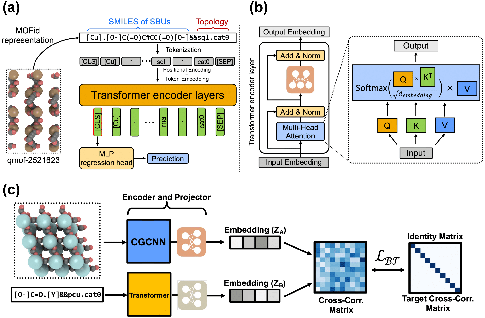

# MOFormer

<strong>MOFormer: Self-Supervised Transformer model for Metal-Organic Framework Property Prediction</strong> </br>
<em>Journal of the American Chemical Society (JACS)</em> [[Paper]](https://pubs.acs.org/doi/10.1021/jacs.2c11420) [[arXiv]](https://arxiv.org/abs/2210.14188) [[PDF]](https://arxiv.org/pdf/2210.14188.pdf) </br>
[Zhonglin Cao*](https://www.linkedin.com/in/zhonglincao/?trk=public_profile_browsemap), [Rishikesh Magar*](https://www.linkedin.com/in/rishikesh-magar), [Yuyang Wang](https://yuyangw.github.io/), [Amir Barati Farimani](https://www.meche.engineering.cmu.edu/directory/bios/barati-farimani-amir.html) (*equal contribution) </br>
Carnegie Mellon University </br>



This is the official implementation of ["MOFormer: Self-Supervised Transformer model for Metal-Organic Framework Property Prediction"](https://pubs.acs.org/doi/10.1021/jacs.2c11420). In this work, we propose a structure-agnostic deep learning method based on the Transformer model, named as <strong><em>MOFormer</em></strong>, for property predictions of MOFs. <strong><em>MOFormer</em></strong> takes a text string representation of MOF (MOFid) as input, thus circumventing the need of obtaining the 3D structure of a hypothetical MOF and accelerating the screening process. Furthermore, we introduce a self-supervised learning framework that pretrains the <strong><em>MOFormer</em></strong> via maximizing the cross-correlation between its structure-agnostic representations and structure-based representations of the crystal graph convolutional neural network (CGCNN) on >400k publicly available MOF data. Benchmarks show that pretraining improves the prediction accuracy of both models on various downstream prediction tasks. If you find our work useful in your research, please cite:

```
@article{doi:10.1021/jacs.2c11420,
    author = {Cao, Zhonglin and Magar, Rishikesh and Wang, Yuyang and Barati Farimani, Amir},
    title = {MOFormer: Self-Supervised Transformer Model for Metal–Organic Framework Property Prediction},
    journal = {Journal of the American Chemical Society},
    volume = {145},
    number = {5},
    pages = {2958-2967},
    year = {2023},
    doi = {10.1021/jacs.2c11420},
    URL = {https://doi.org/10.1021/jacs.2c11420}
}
```


## Getting Started

### Installation

Set up conda environment and clone the github repo

```
# create a new environment
$ conda create -n myenv python=3.9
$ conda activate moformer
$ conda install pytorch==1.10.1 cudatoolkit=11.3 -c pytorch -c conda-forge
$ conda install --channel conda-forge pymatgen
$ pip install transformers
$ conda install -c conda-forge tensorboard

# clone the source code of MOFormer
$ git clone https://github.com/zcao0420/MOFormer
$ cd MOFormer
```

### Dataset

All the data used in this work can be found in `benchmark_datasets` folder. If you use any data in this work, please cite the corresponding reference included in the Acknowledgement.

### Checkpoints

Pre-trained model can be found in `ckpt` folder. 

## Run the Model

### Pre-training

To pre-train the model using SSL from scratch, one can run `python pretrain_SSL.py`. The config file for the pretraining takes as input the directory of the cif file along with a file called `id_prop.npy`. The `id_prop.npy` has `cif id` and its corresponding `mof id` string representation. We have added folder named `cif_toy` with 100 cif files for MOFs and the the corresponding `id_prop.npy` for the data in the `cif_toy` folder. If you intend to run the pretraining for the `cif_toy` folder please make sure you update `config_multiview.yaml` indicating a proper location for the root directory.  The pretraining dataset is available on [figshare](https://figshare.com/articles/journal_contribution/cif_tar_xz/23532918)
```
python pretrain_SSL.py
```

### Fine-tuning

To fine-tune the pre-trained Transformer, one can run `finetune_transformer.py` where the configurations are defined in `config_ft_transformer.yaml`. 
```
python finetune_transformer.py
```
Similarly, to fine-tune the pre-trained CGCNN, one can run `finetune_cgcnn.py` where the configurations are defined in `config_ft_cgcnn.yaml`.
```
python finetune_cgcnn.py
```

We also provide a jupyter notebook `demo.ipynb` for finetuning/supervised training.

## Acknowledgement
- CGCNN: [Paper](https://journals.aps.org/prl/abstract/10.1103/PhysRevLett.120.145301) and [Code](https://github.com/txie-93/cgcnn)
- Barlow Twins: [Paper](https://arxiv.org/abs/2103.03230) and [Code](https://github.com/facebookresearch/barlowtwins)
- Crystal Twins: [Paper](https://www.nature.com/articles/s41524-022-00921-5) and [Code](https://github.com/RishikeshMagar/Crystal-Twins)
- MOFid: [Paper](https://pubs.acs.org/doi/full/10.1021/acs.cgd.9b01050) and [Code](https://github.com/snurr-group/mofid/tree/master)
- Boyd&Woo Dataset [Paper](https://www.nature.com/articles/s41586-019-1798-7)
- QMOF [Paper1](https://www.cell.com/matter/fulltext/S2590-2385(21)00070-9?_returnURL=https%3A%2F%2Flinkinghub.elsevier.com%2Fretrieve%2Fpii%2FS2590238521000709%3Fshowall%3Dtrue) and [Paper2](https://www.nature.com/articles/s41524-022-00796-6)
- hMOF [Paper](https://www.nature.com/articles/nchem.1192)

#### Questions about the code
The graduate students who worked on the paper have graduated from CMU. We monitor the github repository regularly, please feel free raise github issues for questions or concerns about the code. It makes it easier for us to handle the code requests.  
